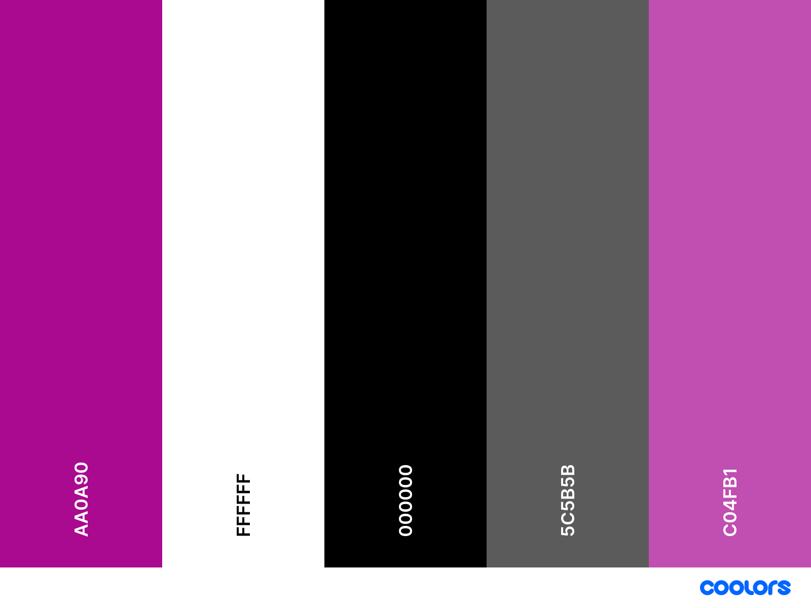

# Nur Home Interiors

[View the live site here](https://github.com/LuiginaA/Nur-Home.git)

# Table of Contents
- [Nur Home Interiors](#nur-home-interiors)
- [Table of Contents](#table-of-contents)
- [Definition](#definition)
- [User Experience (UXD)](#user-experience-uxd)
  - [User Experience (UXD)](#user-experience-uxd-1)
  - [User-Centric Design](#user-centric-design)
  - [Minimal Clicks, Maximum Value](#minimal-clicks-maximum-value)
  - [Environmental Consciousness](#environmental-consciousness)
  - [User Stories](#user-stories)
    - [As a User](#as-a-user)
- [Project Goals](#project-goals)
  - [User Stories: Website Visitors](#user-stories-website-visitors)
- [Design Choices](#design-choices)
  - [Colours](#colours)
    - [Colour Palette Used Throughout the Site:](#colour-palette-used-throughout-the-site)
- [Typography](#typography)
  - [Font Styles](#font-styles)
    - [Custom Fonts](#custom-fonts)
    - [Google Fonts](#google-fonts)
- [Images](#images)
- [Features](#features)
    - [Responsive Design](#responsive-design)
    - [User-Friendly Navigation](#user-friendly-navigation)
    - [Customizable Fonts](#customizable-fonts)
    - [Environmental Awareness](#environmental-awareness)
    - [Inspiration Gallery](#inspiration-gallery)
    - [Client Testimonials](#client-testimonials)
    - [Contact Form](#contact-form)
    - [Custom 404 Page](#custom-404-page)
    - [Future Feature: Educational Resources](#future-feature-educational-resources)
- [Technologies Used](#technologies-used)
  - [Languages Used](#languages-used)
  - [Frameworks and Libraries](#frameworks-and-libraries)
  - [Site Design](#site-design)
  - [Development Tools](#development-tools)
  - [Email Functionality](#email-functionality)
- [Resources](#resources)
- [Hosting](#hosting)
- [Other Technologies](#other-technologies)
  - [Testing](#testing)
- [Deployment](#deployment)
  - [Requirements for Deployment](#requirements-for-deployment)
    - [How to Fork it](#how-to-fork-it)
    - [Making a Local Clone](#making-a-local-clone)
- [Credits](#credits)
    - [Youtube Tutorials](#youtube-tutorials)
- [Acknowledgments](#acknowledgments)
  - [Code](#code)
    - [Content](#content)
    - [Media](#media)
- [Further Acknowledgments](#further-acknowledgments)

# Definition

Nur Home Interiors is an interactive website incorporating various technological elements, offering users a tool to discover and explore the possibility of recreating their personal environments. Whether it's an office or workspace, a home, or just one room in the home, the possibilities are endless. The website aims to create awareness of how to create or decorate a space without exorbitant costs. This is achieved by upcycling old and new pieces of furniture, adding different textures, or elevating the look of a particular item or area, ultimately aiming for a restful, peaceful, and happy outcome.

# User Experience (UXD)

- [User Experience (UXD)](#user-experience-uxd)
- [User-Centric Design](#user-centric-design)
- [Minimal Clicks, Maximum Value](#minimal-clicks-maximum-value)
- [Environmental Consciousness](#environmental-consciousness)

## User Experience (UXD)

This fully responsive website was developed with a strong emphasis on targeting users who wish to create a welcoming and comfortable space in their home or office. 

## User-Centric Design 

By leveraging HTML, CSS, Bootstrap, and some JavaScript, the website aims to provide a seamless and visually appealing interface across various devices. The site prioritises ease of use and accessibility, ensuring that users have an intuitive and enjoyable experience whether they are navigating on a mobile, tablet, or desktop.

## Minimal Clicks, Maximum Value

The website is structured to require as few clicks as possible for users to access the most valuable information for their comfort and lifestyle needs. This approach ensures that users can quickly find what they're looking for without unnecessary navigation hurdles.

## Environmental Consciousness

In addition to meeting users' needs, the website promotes environmental consciousness by incorporating upcycling and recycling methods. By encourages users to adopt sustainable practices in their interior design endeavours, aligning with  environmental responsibility.

## User Stories

### As a User

1. **Explore Interior Design Options**
   - I want to explore different interior design options for my home or workspace.

2. **Upcycling and Recycling Methods**
   - I want to discover ways to recreate my personal environment using upcycling and recycling methods.

3. **Room-Specific Inspiration and Ideas**
   - I want to find inspiration and ideas for enhancing the look and feel of a specific room in my home.

4. **Create a Restful and Happy Environment**
   - I want to learn how to create a restful, peaceful, and happy environment within my budget.

5. **Access to Tutorials and Resources**
   - I want to access tutorial videos and resources that guide me through the process of transforming my living space.

# Project Goals

  **Nur Home Interiors** offers an ideal platform to achieve its objectives. The website ensures seamless navigation across devices—mobile, tablet, and desktop—with a user-friendly and readily accessible navigation bar. This design fosters a comfortable and engaging browsing experience, encouraging users to explore further.

  Upon entering the website, users are greeted with a warm and welcoming atmosphere, complemented by clear and concise guidance on fulfilling their needs.

  In return for visiting the site, users contribute to the owner's goals by taking the initial step towards website development. Leveraging HTML, CSS, and some JavaScript, the owner can craft a functional website, enhancing her portfolio.

## User Stories: Website Visitors

  - **End Users:** 
    - Individuals seeking to upgrade their living or office spaces at a minimal cost while also considering environmental factors.
  
  - **Diverse Audience:** 
    - The project caters to people from various backgrounds and walks of life.
  
  - **Owner's Objective:** 
    - The primary goal is to raise awareness about environmental sustainability while ensuring client satisfaction.

# Design Choices

## Colours

The owner of the website chose to use colours from her logo, which was previously designed for her business card.

The developer selected a background colour that effectively complements the logo colour while evoking a sense of calmness and excitement for the user experience.

### Colour Palette Used Throughout the Site:
[Colour Palette - Coolers.co](https://coolors.co/a71313-3c3cdf-0f0f0f-ffffff-198754-ffca02)

# Typography

  The owner of the website opted to use fonts previously used in her logo for her business card. These fonts were carefully selected to maintain brand consistency and enhance the overall visual identity of the website.

  The website utilises two Google Fonts for the text areas to enhance readability and aesthetics. These are listed below.

## Font Styles

### Custom Fonts

   1. **Font Family: myFont1**
      - **Font Source:** [DIN.ttf](../fonts/din.ttf)
      
   2. **Font Family: myFont2**
      - **Font Source:** [Amazone.otf](../fonts/amazone.otf)
      
   3. **Font Family: myFont3**
      - **Font Source:** [Geogtq.otf](../fonts/geogtq.otf)

### Google Fonts

For other text elements, the following Google Fonts were imported:

   1. **[Courgette](https://fonts.google.com/specimen/Courgette)**
      
      - @import url('https://fonts.googleapis.com/css2?family=Courgette&display=swap');
      font-family: 'Courgette', cursive;

  2. **[Roboto](https://fonts.google.com)**
    
     - @import url('https://fonts.googleapis.com/css2?family=Roboto&display=swap');
 
# Images

The imagery on this site plays a crucial role in conveying its message and aesthetic. Here's a breakdown of the images used:

  - **Logo** 
    - The logo was designed and created by Nur, Interior Designer, and Architect.

  - **Site Images** 
    - All other images on the site were taken and chosen by Nur, the owner of the site.  These images were carefully selected to reflect the values of recycling and upcycling design while prioritising environmental considerations and showcasing the unique beauty of the end product.  

  - **Testimonial Images** 
    - The images featured in the testimonial section of the website were provided by clients as part of their testimonials, highlighting the great workmanship and care provided by Nur.

  - **Icons** 
    - Icons used throughout the site were sourced from Font Awesome and chosen for their clear and obvious meanings, enhancing user understanding and navigation.

- Wireframes

# Features

### Responsive Design

  **Nur Home Interiors** is optimised for seamless viewing and interaction across various devices, ensuring a consistent and user-friendly experience.

### User-Friendly Navigation

  Navigate the site effortlessly with intuitive navigation menus and clear labelling. Whether you're exploring different sections of the website or seeking specific information, you'll find the navigation intuitive and user-friendly.

### Customizable Fonts

  Enhance readability and aesthetics by incorporating two carefully selected Google Fonts for the text areas of the website. These fonts introduce a touch of style and personality to the design, resulting in a cohesive visual experience for users.

### Environmental Awareness
  
  The website advocates sustainable interior design practices, providing valuable tips and resources for upcycling and recycling furniture and decor.

### Inspiration Gallery
  
  Carefully selected images feature creative ideas and examples of upcycled and recycled home decor, inspiring users to reimagine and transform their living spaces.

### Client Testimonials 
   
  Real testimonials from satisfied clients highlight the quality of service and attention to detail provided by Nur Home Interiors.

### Contact Form 

  A user-friendly contact form allows visitors to easily reach out to Nur for inquiries, consultations, or collaborations through a user-friendly contact form. Upon submission of the contact form, the site owner receives an email with the user's details and message. The site also displays a message to the user based on whether or not the form submission was successful.

 ### Custom 404 Page 
 
  A custom-designed 404 error page ensures that users who encounter a broken link or mistyped URL are met with a helpful and aesthetically pleasing message, guiding them back to the main site. The 404 page is created using HTML, CSS, and Bootstrap for consistency with the rest of the site's design.

### Future Feature: Educational Resources

  Be on the lookout for our upcoming Youtube videos, empowering the user with knowledge and techniques for sustainable interior design. 

  - Tutorial Videos
    
    Dive into practical demonstrations and expert insights through tutorial videos covering various aspects of sustainable interior design.

  - Articles
    
    To explore our collection of in-depth articles and guides, offering valuable insights, techniques, and case studies on sustainable interior design practices. With access to tutorial videos and articles, our goal is to enrich your understanding and inspire you to incorporate sustainable design principles into your projects.

- Database Design

# Technologies Used

## Languages Used

- **HTML**
- **CSS**
- **JavaScript** (very limited as still learning this language)

## Frameworks and Libraries

- **Bootstrap** 
  - Version 5.3.2 ([Bootstrap CDN](https://www.bootstrapcdn.com/)) 
  Bootstrap is utilised in this project to enhance responsiveness and styling, ensuring that the website adapts seamlessly across different devices and screen sizes.

- [Bootstrap](https://getbootstrap.com/) 

  A popular front-end framework for building responsive and mobile-first websites is utilised in this project.

## Site Design

 **Icons**

  - [Font Awesome](https://www.bootstrapcdn.com/fontawesome/): Used for adding icons to enhance user experience (UX).
 
**Hover**

  - [Hover.css](https://github.com/IanLunn/Hover): Employed for various CSS3 hover effects.

- **JavaScript Libraries**
  
  - [Popper.js](https://popper.js.org/): Library for positioning poppers in web development.
  - [Lightbox](https://github.com/lokesh/lightbox2): JavaScript library for interactive image and gallery display.
  - [Lightbox Plus jQuery](https://github.com/lokesh/lightbox2): jQuery plugin for interactive image and gallery display.

**Fonts**

- [Google Fonts](https://fonts.google.com/) was used to import the fonts that 
   were used throughout the project.

- **Fonts Used by Owner for Logo**

   - **Font Source:** [DIN.ttf](../fonts/din.ttf)

   - **Font Source:** [Amazone.otf](../fonts/amazone.otf)
   
   - **Font Source:** [Geogtq.otf](../fonts/geogtq.otf)

## Development Tools

- **Integrated Development Environment (IDE)**
  - [Gitpod](https://gitpod.io/workspaces/) was used as the IDE to develop this website.

- **Version Control**
  - [Git](https://git-scm.com/) was used for version control and to Push code to GitHub.

- **Repository Hosting**
  - [GitHub](https://github.com/) is used to store this project's code after being pushed from Git.

## Email Functionality

  - [Youtube Tutorials - Connecting to email accounts](https://web3forms.com/) was used to connect Contact Forms for Modern Websites

# Resources

  - [w3schools](https://www.w3schools.com/default.asp) was used as a general source of knowledge.
    
  - [Google Chrome Developer Tools](https://developer.chrome.com/docs/devtools/) was used throughout the completion of this project to debug, test sizes and layout, and to check responsiveness.

  - [Youtube Tutorials](https://www.youtube.com/) was used as a general source of knowledge.

# Hosting

# Other Technologies

## Testing
 - [W3C Markup Validation Service](https://validator.w3.org/) was used to test that the HTML is valid.
 - [W3C CSS Validation Service](http://jigsaw.w3.org/css-validator/) was used to test that the CSS is valid.

# Deployment

## Requirements for Deployment
  - An IDE (such as GitPod or VSCode)
  - Git, for version control
  - GitHub account
  - Initial Deployment
  - How to Fork it
  - Making a Local Clone

### How to Fork it

1. Login or Sign Up to [GitHub](www.github.com).
    
2. On GitHub, go to [luiginaa.github.oi/Nur-Home](https://github.com/LuiginaA/Nur-Home.git).
   
3. In the top right, click "Fork". This will create a copy of the repository under your GitHub account.

4. Navigate to your GitHub profile and find the forked repository under your repositories.
      - Click on the "Code" button and copy the repository URL.
      - Open a terminal on your local machine and run.
      - Replace your-username with your GitHub username and forked-repo with the name of the repository you forked.

5. Change to the directory of your cloned repository
     - Add the original repository as an upstream remote to keep your fork up-to-date.
     - Replace original-owner and original-repo with the appropriate repository details.
     - 
6. Create a New Branch to work on your changes.
     - Replace my-new-branch with a descriptive name for your branch.

7. Make the necessary changes to the code on your new branch.
   
8. Commit Your changes with a meaningful message.

9. Push the changes to your forked repository on GitHub.

10. Create a Pull Request
    - Navigate to your forked repository on GitHub.
    - You will see a message suggesting to create a pull request for your recently pushed branch. Click on "Compare & pull request".
    - Fill in the details of your pull request, explaining what changes you made and why.
    - Click "Create pull request".
  
11. Keep Your Fork Updated (Optional but recommended)
To keep your fork updated with the original repository, periodically fetch and merge changes from the upstream repository:

### Making a Local Clone

1. Log in to [GitHub](https://www.github.com) and locate the [Repository](https://github.com/) for this site.
 
2. Under the repository name, above the list of files, click "Code".
 
3. Here you can either Clone or Download the repository.
  
4. You should clone the repository using HTTPS, clicking on the icon to copy the link.
 
5. Open Git Bash.
    
6.  Change the current working directory to the new location, where you want the cloned directory to be.
      
7.  Type `git clone`, and then paste the URL that was copied in Step 4.
    * `git clone https://github.com/luiginaa/Nur-Home.git`
  
8.  Press Enter, and your local clone will be created.

# Credits

### Youtube Tutorials

- **Love Running 10: Hero Image Animation**
  - [Unlisted (Code Institute - example project)]

- **How To Make Responsive Navbar with Bootstrap 5 | Step by Step Tutorial**
  - [Web Dev Creative](https://www.youtube.com/watch?v=zOtxP7ahi4M&t=157s)

- **Create a 3D flipping animation with HTML and CSS**
  - [Kevin Powell](https://www.youtube.com/watch?v=FeJEEE3zc4U&t=1292s)

- **How To Make Responsive Image Gallery With HTML CSS JS | Lightbox Image Gallery GreatStack**
  - [GreatStack](https://www.youtube.com/watch?v=cuNyE3SxFlk&t=2s)
  - Complete Responsive Architecture & Interior Design Website Tutorial With HTML / CSS / JS / BOOTSTRAP
  
- **How to Create an XML Sitemap | Register a Sitemap with Google | Learn HTML and CSS**
  - [Dani Krossing](https://www.youtube.com/watch?v=xtoAfUB6Ubw)

- **Testimonials Slider Using Html, Css & Bootstrap 5 | Responsive | Ready To Use**
    - [The WebShala](https://www.youtube.com/watch?v=fRRib2mArXU)

- **How To Make Responsive Image Gallery With HTML CSS JS | Lightbox Image Gallery Design**
    - [GreatStack](https://www.youtube.com/watch?v=4gcy-qT9kGw&t=264s)

- **404 Page Design Using HTML, CSS & Bootstrap**
    - [Coding Fire](https://www.youtube.com/watch?v=pABOf9FU6Uk&t=42s)
  

These tutorials provided valuable insights and guidance for various aspects of the project's development. I extend my gratitude to the creators for sharing their knowledge and expertise.

# Acknowledgments

I also extend my gratitude to the following individuals and resources for their invaluable tutorials and guidance in my journey to frontend development with HTML and CSS as well as some Javascript:

  - **Dani Krossing**
    
    For their comprehensive tutorials that provided me with foundational knowledge and insights into web design and coding.

  - **Kevin Powell**
    
    For their informative tutorials and practical tips that helped me understand the nuances of frontend development.

  - **Bytegrad** 
    
    For their engaging tutorials that guided me through the basics and advanced concepts of HTML and CSS.

  - **Online Tutorials**
     
    For their diverse range of tutorials that catered to various skill levels and topics in web development.

  - **Net Ninja**

    For their clear and concise tutorials that facilitated my learning process and deepened my understanding of frontend technologies.

  - **Web Coding Pro**
     
    For their valuable tutorials that expanded my knowledge and skills in frontend development.

  - **Brian Design**
    
    For their insightful tutorials that inspired and guided me in my journey to mastering HTML and CSS.

  - **Web Dev Simplified**

    For their valuable tutorials that simplified complex concepts and accelerated my learning in frontend development.

  - **SuperSimpleDev**

    For their insightful tutorials and practical advice that contributed to my growth and proficiency in HTML and CSS.

  - **Coding Fire**

    These tutorials provided valuable insights and guidance for various aspects of the project's development. 

The tutorials provided by these individuals have been instrumental in shaping my understanding and skills in frontend development. I extend my heartfelt appreciation for their invaluable contributions. Their guidance has significantly contributed to my growth and proficiency in frontend development. I am deeply grateful for their dedication to educating and empowering developers.

## Code

### Content

- The content and information on this site were created by Nur Yilmas Ruppi.
- Quotes were selected by Nur Yilmas Ruppi and attributed to their respective authors.
- Unreferenced quotes on the site were written by Nur Yilmas Ruppi.
- The testimonials were given and written by the respective authors themselves.

### Media

- The site logo was designed by Nur Yilmas Ruppi, the owner of this site.
- All photos were taken by Nur Yilmas Ruppi.
- All photos for the testimonials were provided by the respective clients.

# Further Acknowledgments

- **Nur Yilmas Ruppi:** 
  
  I am deeply grateful to Nur Yilmas Ruppi for giving me the opportunity to design and create the initial website for Nur Home Interiors.
  
- **Carla Buongiorno-Vermaak:** 
  
  My heartfelt thanks to my niece and inspiration, Carla Buongiorno-Vermaak, for her immense support and dedication. Her time, effort, and love have been instrumental in helping me navigate and progress on this journey. Carla's assistance in overcoming challenges and her invaluable feedback were crucial in the creation of this site. I am especially thankful for her willingness to support me, even when it meant sacrificing time with her family and work.